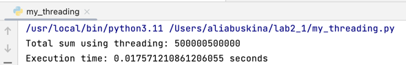
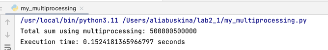
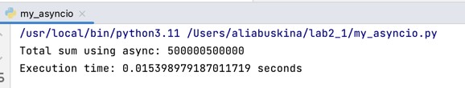

### Задача 1. Различия между threading, multiprocessing и async в Pythonя
Задача: Напишите три различных программы на Python, использующие каждый из подходов: threading, multiprocessing и async. Каждая программа должна решать считать сумму всех чисел от 1 до 1000000. Разделите вычисления на несколько параллельных задач для ускорения выполнения.

Подробности задания:

Напишите программу на Python для каждого подхода: threading, multiprocessing и async.
Каждая программа должна содержать функцию calculate_sum(), которая будет выполнять вычисления.
Для threading используйте модуль threading, для multiprocessing - модуль multiprocessing, а для async - ключевые слова async/await и модуль asyncio.
Каждая программа должна разбить задачу на несколько подзадач и выполнять их параллельно.
Замерьте время выполнения каждой программы и сравните результаты.

#### threading
```python
import threading
import time

def calculate_sum(start, end, result):
    partial_sum = sum(range(start, end))
    result.append(partial_sum)

def main():
    result = []
    thread1 = threading.Thread(target=calculate_sum, args=(1, 500001, result))
    thread2 = threading.Thread(target=calculate_sum, args=(500001, 1000001, result))

    start_time = time.time()

    thread1.start()
    thread2.start()

    thread1.join()
    thread2.join()

    total_sum = sum(result)

    end_time = time.time()
    execution_time = end_time - start_time

    print("Total sum using threading:", total_sum)
    print("Execution time:", execution_time, "seconds")

if __name__ == "__main__":
    main()
```


#### multiprocessing
```python
from multiprocessing import Process, Queue
import time

def calculate_sum(start, end, result):
    partial_sum = sum(range(start, end))
    result.put(partial_sum)

def main():
    result = Queue()
    process1 = Process(target=calculate_sum, args=(1, 500001, result))
    process2 = Process(target=calculate_sum, args=(500001, 1000001, result))

    start_time = time.time()

    process1.start()
    process2.start()

    process1.join()
    process2.join()

    total_sum = 0
    while not result.empty():
        total_sum += result.get()

    end_time = time.time()
    execution_time = end_time - start_time

    print("Total sum using multiprocessing:", total_sum)
    print("Execution time:", execution_time, "seconds")

if __name__ == "__main__":
    main()
```


#### async
```python
import asyncio
import time

async def calculate_sum(start, end):
    return sum(range(start, end))

async def main():
    task1 = asyncio.create_task(calculate_sum(1, 500001))
    task2 = asyncio.create_task(calculate_sum(500001, 1000001))

    start_time = time.time()

    result1 = await task1
    result2 = await task2

    total_sum = result1 + result2

    end_time = time.time()
    execution_time = end_time - start_time

    print("Total sum using async:", total_sum)
    print("Execution time:", execution_time, "seconds")

if __name__ == "__main__":
    asyncio.run(main())
```
